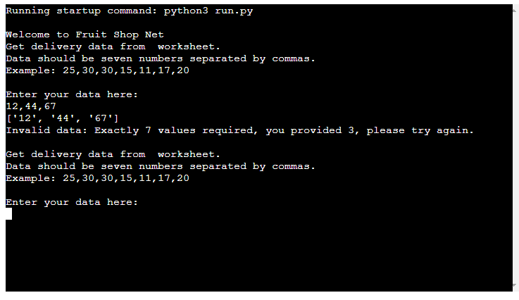
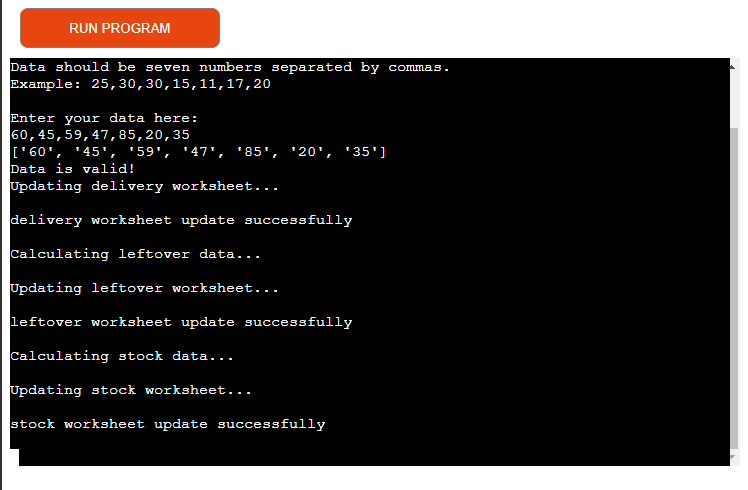
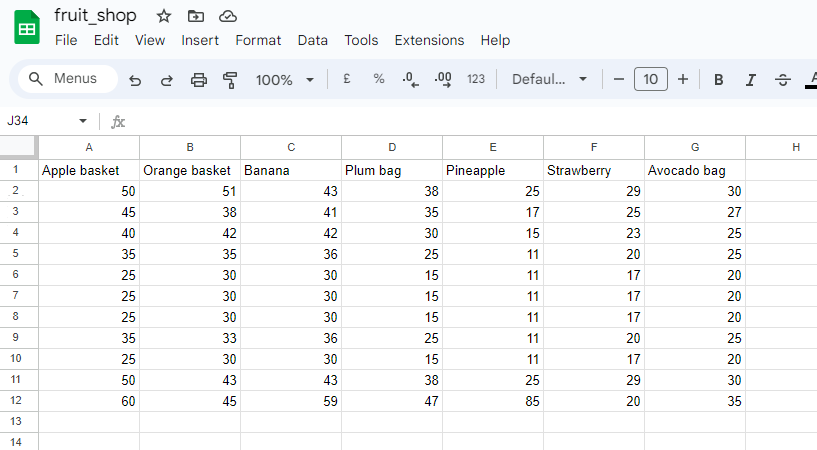
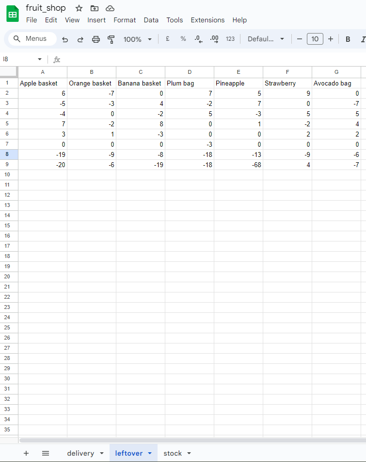
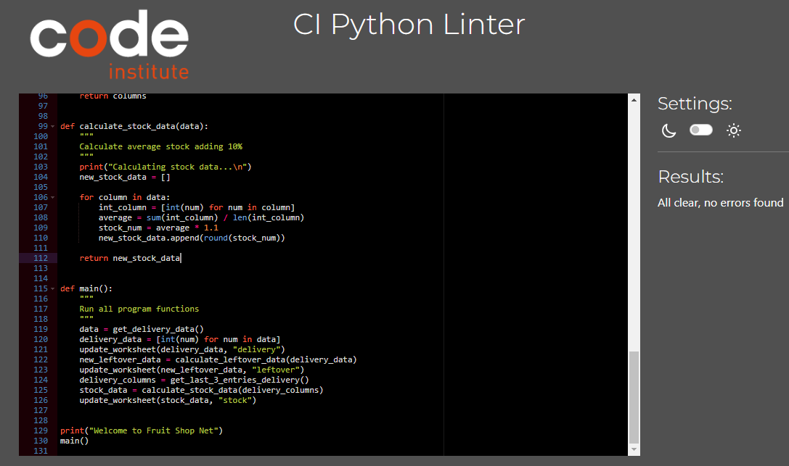
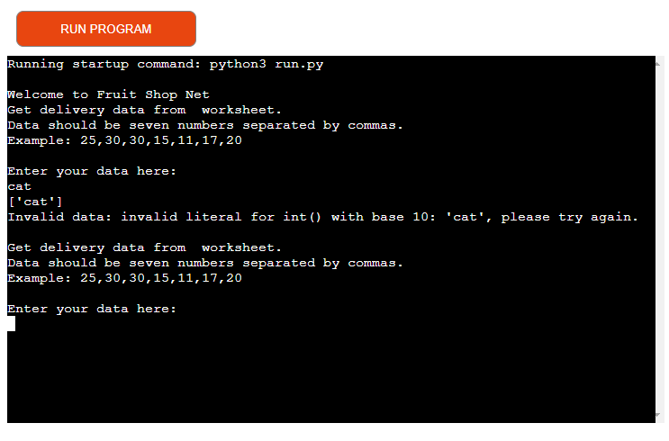
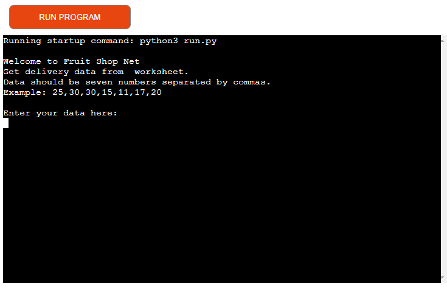

The live link to Fruit Shop can be found here - <https://fruit-shop-4f71080fd68f.herokuapp.com/>

# Fruit Shop Net
Is a python game which runs in the Code Institute mock terminal on Heroku. Fruit Shop is a company that runs fruit delivery and serves its customer with deferent kind of fruit each morning Monday to Friday..!

[Responsive Mock-up](readme/responsive.png)
I created a data automation to help their staff pre-make stock to sell by collecting the company's daily data and worksheets in order to calculate their daily supplies and returns so that they will know how many baskets of fruit they will order for the next market day. 

## Features

### Existing Features
    . There is google sheet with data to work with. The google sheet contains both the delivery data, leftover data and stock data worksheets . And these worksheets are being updated each time user enters new data.

    . The leftover data has both positive and negative number. The negative numbers are leftovers fruit while the positive numbers are when the staff pre-order extra fruit when the stock ran of out fruits.
    . Each time a new data is entered in data automation terminal, the worksheet is updated with a new data as well and in order for the worksheet to update each time a new user enters new data, API was used. API allows different applications to share data. I set up API which allows my python project to access and update data in the spreadsheet.

### Features Left to Implement
    . Make the app display what is in the spreadsheet. The spreadsheet contains delivery, leftover and stock data. which should be display on the app screens.
    . Give users the ability to choose what they want to do for example Hello user! What do you want to do today? Then an option to choose if the users want to view data or to input data or to see the leftover data.

## Testing

I have tested this project code by:
    . Pasting the code on PEP8 linter and there were no error found. 
    . Tested after deployment on Code Institute Heroku terminal and it run successfully and the google worksheet was updated each time I enter a new data.
    . I have tested both valid and invalid data . When invalid data is entered, it tells users the data entered is invalid and tells user what data to enter "Data should be seven numbers, separated by commas. 

## Bugs
    . No bugs found and no warning left either.

## Validator Testing
    . No errors were returned from PEP8online.com
    .......    

## Deployment

This project was deployed using Code Institute's mock terminal for Heroku and the steps for deployment are as followed:
### First step
    . Sign in to Heroku app
    . Create a new app using unique name like the name of the project.
    . Go to setting and create a _Config Var_ called `PORT`. Set the value to `8000`
    . Add another _Config Var_ called `CREDS` and here I added my `creds.json` file which was not pushed to github.
    . Then click on  buildpacks and add the following:
1. `heroku/python`
2. `heroku/nodejs`  making sure that heroku/python is the first.

### Second step
  Click on deploy at the top left side and select github to connect to github. Confirm your connection to github and search for the github repository name, click connect to link up the Heroku app creacted ealier with the github repository.
    . Choose either automatic deploy or manual. I used manual which is deploy branch.
    . Allow the app to build until it shows successfully then click view and it takes me to my deployed link.

Credits
    . Anna Graves for love sandwiches walkthrough project
    . This app is built using Code Institute's template.
    . Fruit Shop data entry was built with knowledge from the love sandwiches walkthrough project created by Anna Graves of Code Institute.
